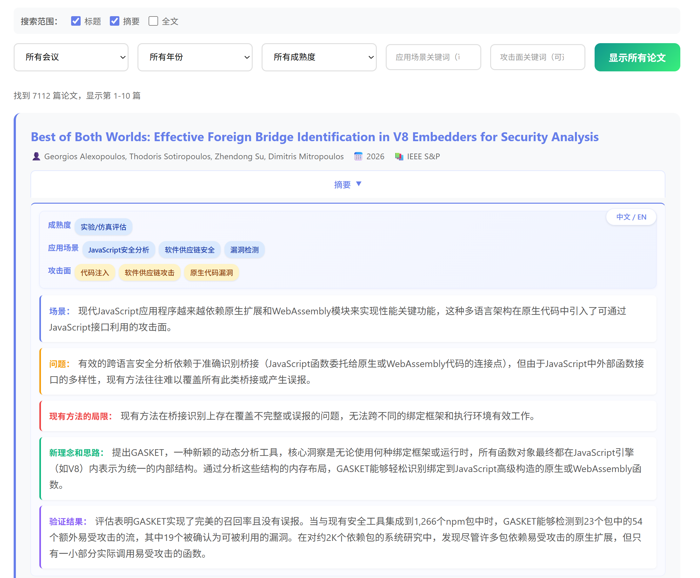
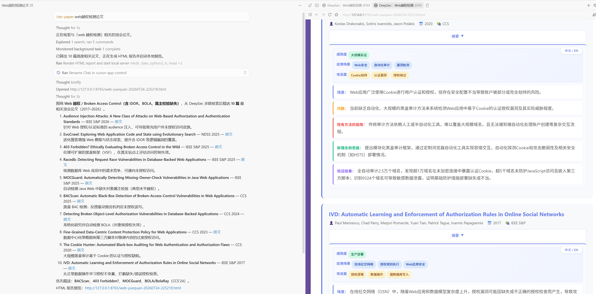

# DeepSec http://deepsec.chat/
智能化网络安全论文检索系统,探索 AI 原生：本站 100% 由人工智能自主构建



# SecPaper Skills

面向 [DeepSec](http://deepsec.chat/) 的 **可移植 Agent Skill**。**SecPaper** 通过公开 HTTP API 检索顶会论文并在对话中总结；HTML 本地报告为可选项（需明确要求）。兼容任意能加载标准 `SKILL.md` 包的 Agent。

## 一句话安装

复制下面这段话给 Agent：

> 从https://github.com/rainkin1993/DeepSec/ 安装skill

## 效果 Demo



示例指令：`/sec-paper web越权检测论文` —— Agent 英文优先、并发检索，并在对话中汇总相关论文（≤20 篇给详细解读）。

## 能力

| 能力 | 说明 |
|------|------|
| 论文检索 | 关键词 / 作者 / 机构 / 会议·年份·场景·攻击面 |
| 检索策略 | **英文技术词优先**、多路 **并发** 查询、首轮即申请出网权限 |
| 对话总结 | ≤20 篇详细卡片；>20 篇精简列表 |
| HTML 报告 | **默认关闭**；用户明确要求时可用 `scripts/*.py` + `127.0.0.1` 预览 |

### 依赖说明

| 能力 | 是否需要 Python |
|------|----------------|
| 调用 DeepSec API 检索 + 对话总结 | **不需要** |
| 生成 / 预览 HTML 报告 | **需要**（Python **2.7+** 或 **3.x**，标准库即可） |

说明：报告脚本 shebang 为 `#!/usr/bin/env python`，已兼容 Python 2/3。优先使用 `python3`，否则 `python` / `python2`。无 Python 时跳过报告即可，检索与文字总结仍可用。

### 使用

安装后在对话中附带 / 提及 skill，例如：

```text
/sec-paper fuzzing CCS 2024
/sec-paper 查找 IDOR / broken access control 相关论文
```

只要精简列表时可说明；需要 HTML 报告时请明确要求。

### 公开 API

Skill 仅调用 DeepSec 公开论文接口（`http://deepsec.chat`），详见 [`skills/sec-paper/SKILL.md`](skills/sec-paper/SKILL.md)。无需鉴权。

## 仓库结构

```text
.
├── README.md
├── assets/
│   └── demo.png
└── skills/sec-paper/
    ├── SKILL.md
    ├── assets/
    └── scripts/
```

本地运行产生的 `deepsec-papers/` 已加入 `.gitignore`，不会提交。

## 许可与站点

- 站点：[http://deepsec.chat/](http://deepsec.chat/)
- 本仓库 skill 与脚本按仓库许可使用；检索数据来自 DeepSec 公开 API。
